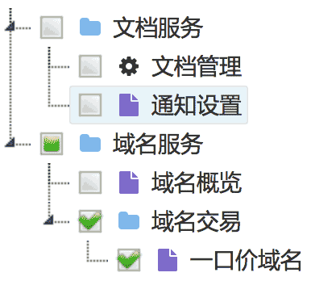

# 状态树

## 1. 简介

对 jstree.js 的简单封装。
  
依赖：
 * [jQuery](http://jquery.com/)
 * [jstree](https://www.jstree.com/)
 * [font-awesome](http://fontawesome.io/)
 
说明
 * 在PKUI里，已包含这些依赖文件

## 2. 编撰

  吴钦飞（wuqinfei@qq.com）
  
## 3. 示例

演示：https://forwardnow.github.io/statetree/dist/index.html

## 4. 使用

    

    

### 4.1 参数

参考：`dist/index.html`

    

    
### 4.2 API

参考：`src/tree.js`

* `$selectTree.stateTree( "getData" );`
    * @description 获取原始数据
    * @return {Array}
* `$selectTree.stateTree( "getNodeById", idList );`
    * @description 获取指定id的节点
    * @param idList {String|Array} 单个id字符串 或 多个id组成的数组
    * @return {Array} 
* `$selectTree.stateTree( "getSelectedNodes" );`
    * @description 获取选中的节点
    * @return {Array}
* `$selectTree.stateTree( "selectNodeById", idList );`
    * @description 选中指定id的节点
    * @param idList {String|Array} 单个id字符串 或 多个id组成的数组
* `$selectTree.stateTree( "deselectNodeById", idList );`
    * @description 反选指定id的节点
    * @param idList {String|Array} 单个id字符串 或 多个id组成的数组